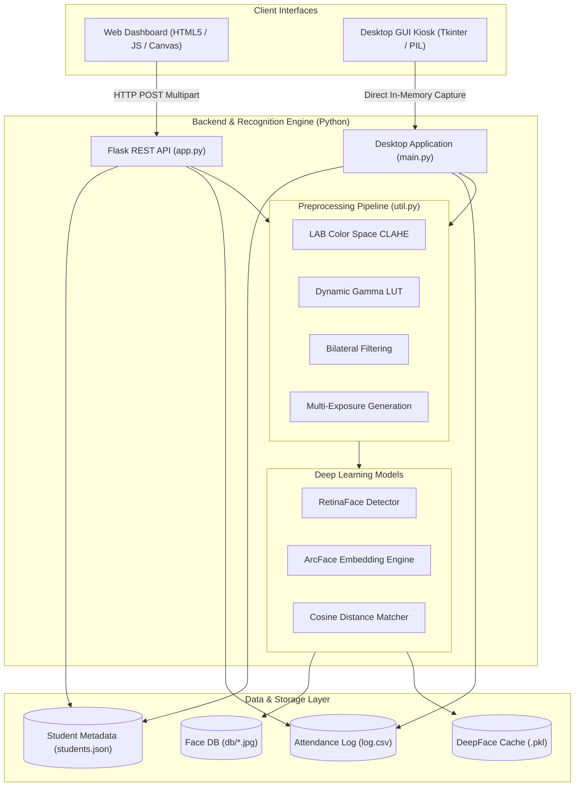

# 👤 DBIT AI Face Recognition Attendance System

[](https://www.python.org/)
[](https://flask.palletsprojects.com/)
[](https://github.com/serengil/deepface)
[](https://opencv.org/)
[](#interfaces)

An enterprise-grade, real-time facial recognition attendance management system powered by **DeepFace (ArcFace)** and **RetinaFace**, featuring an adaptive lighting and skin-tone-aware image preprocessing pipeline. The system supports both a modern web-based single-page application (SPA) dashboard and a standalone desktop kiosk GUI.

---

## 📑 Table of Contents
- [🌟 Key Features](#-key-features)
- [🏗️ System Architecture](#️-system-architecture)
- [📁 Project Structure](#-project-structure)
- [⚙️ Tech Stack & Dependencies](#️-tech-stack--dependencies)
- [🚀 Installation & Setup](#-installation--setup)
- [🖥️ Usage Guide](#️-usage-guide)
  - [1. Running the Web Application (Recommended)](#1-running-the-web-application-recommended)
  - [2. Running the Desktop GUI Kiosk](#2-running-the-desktop-gui-kiosk)
  - [3. Running System Diagnostics](#3-running-system-diagnostics)
  - [4. Batch Re-registration](#4-batch-re-registration)
- [📡 API Reference](#-api-reference)
- [🔬 Face Recognition & Preprocessing Pipeline](#-face-recognition--preprocessing-pipeline)
- [📊 Data Storage & Logging](#-data-storage--logging)
- [🔧 Configuration](#-configuration)
- [❓ Troubleshooting & FAQ](#-troubleshooting--faq)
- [📜 License & Credits](#-license--credits)

---

## 🌟 Key Features

- 🎯 **High-Accuracy Biometric Matching**: Powered by **ArcFace** embeddings and **RetinaFace** face detector with cosine distance metrics.
- 💡 **Skin-Tone Aware & Adaptive Lighting Preprocessing**:
  - Contrast Limited Adaptive Histogram Equalization (**CLAHE**) in CIELAB color space.
  - Adaptive gamma correction lookup tables (LUT) for low-light compensation.
  - Bilateral filtering for noise removal while preserving crisp facial boundary details.
  - Multi-exposure variant generation (normal, overexposed, and underexposed) to ensure invariant matching across challenging lighting conditions.
- 🌐 **Modern Web Dashboard**:
  - Dark-mode responsive interface built with glassmorphism aesthetics and smooth transitions.
  - Real-time webcam streaming and instant face detection feedback.
  - Tabs for **Mark Attendance (Entry)**, **Mark Exit**, **Student Registration**, and **Live Logs**.
  - One-click CSV attendance export filtered by date.
- 🖥️ **Standalone Desktop GUI**:
  - Full-featured Tkinter-based desktop interface for standalone kiosk deployments.
  - Real-time OpenCV video stream with quick registration modals and duplicate attendance prevention.
- 🛡️ **Duplicate Check & Anti-Passback Prevention**: Automatically prevents duplicate logging for the same student on the same day.
- 🩺 **Built-in Diagnostic Suite**: Comprehensive 7-stage pipeline test (`diagnose.py`) for OpenCV/RetinaFace detection, ArcFace vector norm checks, cross-similarity validation, and live camera testing.

---

## 🏗️ System Architecture



---

## 📁 Project Structure

```
face-recognition-project/
├── face-recognition-project-main/
│   ├── app.py              # Flask REST API backend server
│   ├── main.py             # Tkinter desktop GUI kiosk application
│   ├── util.py             # Preprocessing pipeline and DeepFace helper utilities
│   ├── diagnose.py         # 7-stage diagnostic and testing suite
│   ├── reregister.py       # Batch face re-capture utility for existing students
│   ├── requirements.txt    # Python dependencies list
│   ├── students.json       # Registered student metadata store
│   ├── log.csv             # Attendance records (Roll No, Name, Div, Dept, Timestamp, Status)
│   ├── db/                 # Registered facial image database (<ROLL_NO>.jpg)
│   └── frontend/
│       └── index.html      # Responsive web application interface
└── README.md               # Project documentation
```

---

## ⚙️ Tech Stack & Dependencies

| Component | Technology | Description |
| :--- | :--- | :--- |
| **Language** | Python 3.9+ | Core application runtime |
| **Backend Framework** | Flask 3.0+, Flask-CORS | REST API handling HTTP endpoints |
| **Face Recognition** | DeepFace 0.0.93+ | Multi-model facial analysis library |
| **Face Embedding Model** | ArcFace | High-dimensional discriminative face representation |
| **Face Detector** | RetinaFace | Robust multi-stage face detection backend |
| **Deep Learning Backend**| TensorFlow 2.15+, tf-keras | Neural network execution engine |
| **Computer Vision** | OpenCV 4.9+ (`opencv-python`) | Frame capture, color conversions, CLAHE & filters |
| **Web Frontend** | HTML5, Vanilla CSS, Modern JS | Real-time browser client interface |
| **Desktop Frontend** | Tkinter, Pillow (PIL) | Native desktop kiosk interface |

---

## 🚀 Installation & Setup

### 1. Clone or Extract the Repository
```bash
cd face-recognition-project/face-recognition-project-main
```

### 2. Create and Activate a Virtual Environment
```bash
# Windows (PowerShell)
python -m venv venv
.\venv\Scripts\Activate.ps1

# Linux / macOS
python3 -m venv venv
source venv/bin/activate
```

### 3. Install Dependencies
```bash
pip install --upgrade pip
pip install -r requirements.txt
```

> [!NOTE]
> On first run, DeepFace will automatically download the pretrained weights for **ArcFace** and **RetinaFace** into your user `~/.deepface/weights` directory. Ensure you have an active internet connection for the initial download.

---

## ☁️ Deploying to Render (Cloud Hosting)

The project includes all files needed for 1-click or automated deployment to [Render](https://render.com):
- `Procfile`: Production Gunicorn command with worker timeout configuration.
- `render.yaml`: Render Blueprint infrastructure-as-code file.
- `runtime.txt`: Standardized Python 3.11 runtime environment.

### Steps to Deploy:

1. **Push your updated repository to GitHub**:
   ```bash
   git add .
   git commit -m "Configure repo for Render deployment and cleanup junk files"
   git push origin main
   ```

2. **Create a New Web Service on Render**:
   - Log in to your [Render Dashboard](https://dashboard.render.com/).
   - Click **New +** → **Web Service**.
   - Connect your GitHub repository (`shaun1210/face-recognition-project`).
   - Configure the following settings:
     - **Name**: `face-recognition-attendance` (or your choice)
     - **Region**: Select the region closest to you (e.g., *Singapore*, *Frankfurt*, *Oregon*)
     - **Runtime**: `Python 3`
     - **Build Command**: `pip install --upgrade pip && pip install -r requirements.txt`
     - **Start Command**: `gunicorn app:app --bind 0.0.0.0:$PORT --workers 1 --threads 4 --timeout 180`
     - **Instance Type**: Free or Starter tier.

3. **Environment Variables (Optional)**:
   - Under the **Environment Variables** section in Render, add:
     - `PYTHON_VERSION`: `3.11.8`
     - `TF_CPP_MIN_LOG_LEVEL`: `3`
     - `TF_ENABLE_ONEDNN_OPTS`: `0`

4. **Deploy**:
   - Click **Create Web Service**.
   - Render will build your environment and launch your live URL (e.g. `https://your-service.onrender.com`).
   - You can visit the root URL directly in any browser to access the full attendance dashboard with live webcam support!

---

## 🖥️ Usage Guide

### 1. Running the Web Application (Recommended)

1. **Start the Flask Backend Server:**
   ```bash
   python app.py
   ```
   *The server starts by default on `http://localhost:5000`.*

2. **Open the Web Frontend:**
   - Simply open `frontend/index.html` in any modern web browser (Chrome, Edge, Firefox, Brave).
   - Alternatively, serve it via any static web server:
     ```bash
     # Optional: using Python's built-in HTTP server from frontend/
     cd frontend
     python -m http.server 3000
     ```
     Then navigate to `http://localhost:3000`.

3. **Web Features:**
   - **Mark Entry / Attendance**: Select camera feed -> Click **Mark Attendance** -> Real-time feedback with confidence score.
   - **Mark Exit**: Switch to Exit mode to record departure timestamps.
   - **Register Student**: Fill in Roll No, Full Name, Division, and Department, capture your face via camera, and click **Register Face**.
   - **Attendance Log & Export**: View today's entries with filter controls and download the CSV report.

---

### 2. Running the Desktop GUI Kiosk

If you are running the system as a dedicated physical kiosk without a browser:
```bash
python main.py
```
- A window will launch displaying the live camera feed on the left and operation buttons on the right.
- Buttons allow marking **Entry**, **Exit**, registering **New Student**, viewing the **Attendance Log**, and **Exporting CSV**.

---

### 3. Running System Diagnostics

To verify your camera, check dataset integrity, inspect face detection backends, and test ArcFace cosine similarity thresholds:
```bash
python diagnose.py
```

The script runs 7 checks:
1. Validates all face images in `db/` and their dimensions.
2. Runs OpenCV face detector on stored images.
3. Runs RetinaFace face detector on stored images.
4. Generates and validates ArcFace vector embeddings (norm and dimensions).
5. Computes pairwise cross-image cosine distance.
6. Performs full `DeepFace.find()` lookup test against the database.
7. Captures a live webcam frame and evaluates real-time matching.

---

### 4. Batch Re-registration

If you update the preprocessing parameters or want to re-capture all existing students in `students.json` with fresh embeddings:
```bash
python reregister.py
```

---

## 📡 API Reference

Base URL: `http://localhost:5000`

### 1. Health Check
- **Endpoint**: `GET /health`
- **Response**:
```json
{
  "status": "ok",
  "service": "DBIT Face Attendance API",
  "version": "2.0",
  "students": 12,
  "db_dir": "/path/to/db"
}
```

### 2. Register Student
- **Endpoint**: `POST /register`
- **Content-Type**: `multipart/form-data`
- **Parameters**:
  - `roll` *(string)*: Unique student roll number (e.g., `"101"`).
  - `name` *(string)*: Student full name (e.g., `"John Doe"`).
  - `division` *(string)*: Class division (e.g., `"A"`).
  - `department` *(string)*: Department name (e.g., `"Computer Engineering"`).
  - `image` *(file)*: Binary JPEG/PNG image file containing a clear face.
- **Response**:
```json
{
  "status": "success",
  "message": "John Doe (Roll: 101) registered successfully!"
}
```

### 3. Recognize & Mark Attendance (Entry)
- **Endpoint**: `POST /recognize`
- **Content-Type**: `multipart/form-data`
- **Parameters**:
  - `image` *(file)*: Camera frame snapshot.
- **Response**:
```json
{
  "status": "success",
  "name": "John Doe",
  "roll": "101",
  "division": "A",
  "department": "Computer Engineering",
  "confidence": 88.4,
  "duplicate": false,
  "message": "Welcome John Doe! Attendance marked. (88.4% confidence)"
}
```

### 4. Mark Exit
- **Endpoint**: `POST /exit`
- **Content-Type**: `multipart/form-data`
- **Parameters**:
  - `image` *(file)*: Camera frame snapshot.
- **Response**:
```json
{
  "status": "success",
  "name": "John Doe",
  "roll": "101",
  "division": "A",
  "department": "Computer Engineering",
  "confidence": 89.1,
  "duplicate": false,
  "message": "Goodbye John Doe! Exit marked. (89.1% confidence)"
}
```

### 5. Fetch Today's Attendance
- **Endpoint**: `GET /attendance_today`
- **Response**:
```json
[
  {
    "Roll No": "101",
    "Name": "John Doe",
    "Division": "A",
    "Department": "Computer Engineering",
    "Timestamp": "2026-09-11 09:15:32",
    "Status": "present"
  }
]
```

### 6. List Registered Students
- **Endpoint**: `GET /students`
- **Response**:
```json
{
  "101": {
    "roll": "101",
    "name": "John Doe",
    "division": "A",
    "department": "Computer Engineering"
  }
}
```

### 7. Export CSV
- **Endpoint**: `GET /export_csv?date=YYYY-MM-DD`
- **Response**: Attachment file `attendance_YYYY-MM-DD.csv`.

---

## 🔬 Face Recognition & Preprocessing Pipeline

To guarantee high accuracy across varied ethnicities, complexions, and ambient lighting conditions, each captured frame passes through a tailored computer vision pipeline:

```
[Input BGR Frame]
       │
       ▼
[Convert to CIELAB Color Space] ──► Split L, A, B channels
       │
       ▼
[Adaptive CLAHE on L-Channel]   ──► Dynamic clip limit (2.5 for L<100, else 1.8)
       │
       ▼
[Merge & Convert back to BGR]
       │
       ▼
[Bilateral Filter (d=7, σ=50)]  ──► Edge-preserving denoising
       │
       ▼
[Low-Light Gamma Correction]    ──► Applies LUT (γ=1.3) if mean luminance < 80
       │
       ▼
[Multi-Exposure Triplet Gen]    ──► Generates Normal, +20% Gain, -15% Gain variants
       │
       ▼
[RetinaFace Face Detection]     ──► High-precision face localization & alignment
       │
       ▼
[ArcFace 512D Embedding]        ──► Extract discriminative feature vector
       │
       ▼
[Cosine Distance Thresholding]  ──► Threshold ≤ 0.45 (Confidence ≥ 55%)
```

---

## 📊 Data Storage & Logging

- **Images Database (`db/`)**: Contains preprocessed face reference images named `<roll>.jpg`. When a new student is registered, any existing `.pkl` cache representation files are automatically purged to guarantee fresh vector indexing.
- **Student Metadata (`students.json`)**:
  ```json
  {
    "101": {
      "roll": "101",
      "name": "John Doe",
      "division": "A",
      "department": "Computer Engineering"
    }
  }
  ```
- **Attendance Records (`log.csv`)**:
  ```csv
  Roll No,Name,Division,Department,Timestamp,Status
  101,John Doe,A,Computer Engineering,2026-09-11 09:30:15,present
  101,John Doe,A,Computer Engineering,2026-09-11 17:00:22,exit
  ```

---

## 🔧 Configuration

Key parameters can be adjusted directly in `app.py` and `util.py`:

| Parameter | Default Value | Description |
| :--- | :--- | :--- |
| `DEEPFACE_MODEL` | `'ArcFace'` | Recognition model (`ArcFace`, `Facenet512`, `VGG-Face`, `SFace`) |
| `DEEPFACE_BACKEND` | `'retinaface'` | Face detector (`retinaface`, `opencv`, `mtcnn`, `mediapipe`) |
| `DISTANCE_METRIC` | `'cosine'` | Similarity calculation metric (`cosine`, `euclidean`) |
| `CONFIDENCE_THRESHOLD` | `0.45` | Cosine distance cut-off threshold (lower is stricter) |
| `PORT` | `5000` | Flask server listening port |

---

## ❓ Troubleshooting & FAQ

<details>
<summary><b>1. "No face detected" error during registration or recognition</b></summary>

- Ensure good front-facing lighting without heavy backlighting.
- Maintain a distance of 1.5 to 3 feet from the webcam.
- Look directly into the camera lens with a neutral expression.
</details>

<details>
<summary><b>2. Recognition is slow on initial startup</b></summary>

- DeepFace builds an embedding index cache on the first lookup. Subsequent lookups will be significantly faster.
- For GPU acceleration, ensure CUDA and cuDNN compatible with your TensorFlow version are installed.
</details>

<details>
<summary><b>3. Web camera permissions blocked in browser</b></summary>

- Check browser settings to ensure camera permissions are granted for `localhost` or your domain.
- Ensure no other application (like Zoom, Teams, or the Tkinter GUI) is actively locking the camera device.
</details>

---

## 📜 License & Credits

- Developed for **DBIT** (Don Bosco Institute of Technology) Face Attendance & Biometric Access Management.
- Powered by [DeepFace](https://github.com/serengil/deepface) by Sefik Ilkin Serengil.
